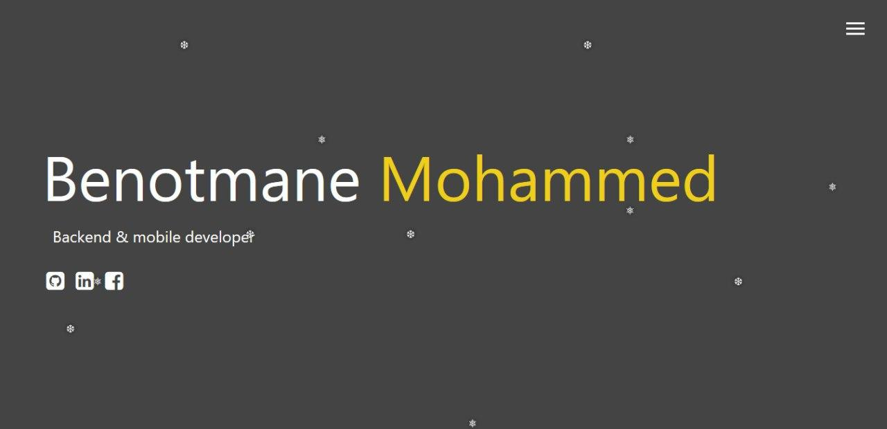
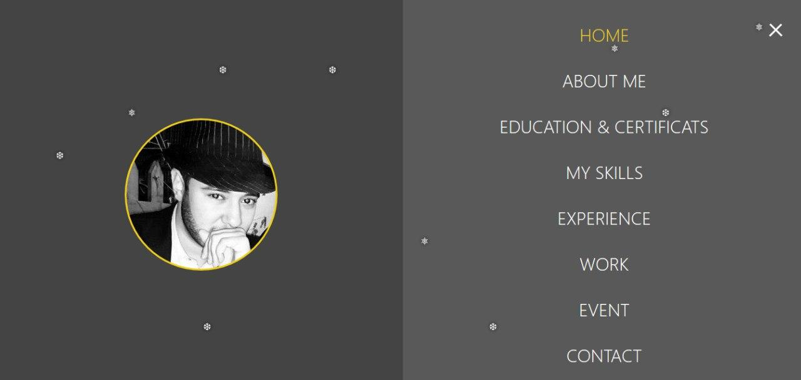
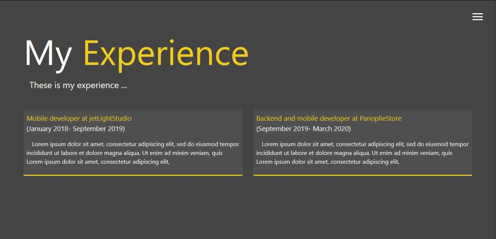

# Portfolio
https://abir-bouhriz.github.io/portfolio/index.html
## Description:
This repo contains a portfolio resume that showcases examples of  skills along with the usual resume information about work experience. It was created with HTML, CSS and Javascript. It is lightweight and fully responsive.
## Tools & languages:
* HTML
* CSS
* JavaScript
* Sublime Text ( Text editor )
## ScreenShots:

